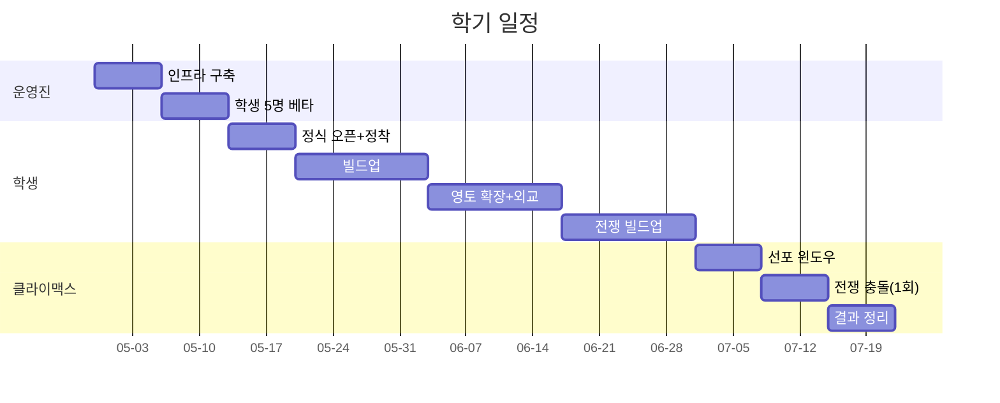

# 🏰 총학생회 봉건제 마인크래프트 서버

> 9개 국서가 황제국과 영주국으로 나뉘어 한 학기 동안 영토·자원·외교를 두고 경쟁하는 봉건 정치 시뮬레이션 마크 서버.

## 🚀 빠른 접속

!!! tip "서버 주소"
    **`policies-untagged.gl.joinmc.link`** ← 마크 클라에서 이 한 줄을 그대로 붙여넣기

!!! warning "에디션 주의"
    **Java Edition 1.21.x만 지원** — Bedrock(모바일·콘솔판) 접속 불가.

[자세한 접속 가이드 →](JOIN-GUIDE.md){ .md-button .md-button--primary }
[안 들어갈 때 →](troubleshooting.md){ .md-button }

## 📋 3단계로 끝나는 첫 접속

=== "1️⃣ Java Edition 설치"
    1. <https://www.minecraft.net/download> 접속
    2. Minecraft Launcher 다운로드 + 설치
    3. Microsoft 계정 로그인 (정품 라이센스 필요)

    > Bedrock Edition (모바일·콘솔)은 호환 안 됨.

=== "2️⃣ 서버 등록"
    1. Minecraft 실행 → **멀티플레이** 클릭
    2. **서버 추가** 클릭
    3. 서버 주소: `policies-untagged.gl.joinmc.link`

=== "3️⃣ 화이트리스트 등록"
    운영진에게 본인 Minecraft 닉네임 전달 → 등록 받기.
    
    등록 안 된 상태에서 접속 시도하면 `Not whitelisted on this server` 오류.

## 🏛️ 9개 국서 (Nations)

| 국서 | 위상 | 영토 방위 |
|------|------|-----------|
| **회장단** | 👑 황제국 | 정북 (월드 spawn에서 가장 가까움) |
| 사무총괄국 | 🛡️ 영주국 | 동 |
| 재정관리국 | 🛡️ 영주국 | 남동 |
| 대외협력국 | 🛡️ 영주국 | 남 |
| 미래전략실 | 🛡️ 영주국 | 남서 |
| 비서실 | 🛡️ 영주국 | 서 |
| 나눔복지국 | 🛡️ 영주국 | 북서 |
| 문화기획국 | 🛡️ 영주국 | 북 (회장단 너머) |
| 소통연결국 | 🛡️ 영주국 | 북동 |

!!! note "봉건 위계는 룰로 강제"
    Towny 시스템상으로는 9개 동등 nation이지만, 룰북·Discord 권위로 봉건 위계가 강제됩니다. 황제국 함락 시나리오(반란)도 SiegeWar로 가능 — 정치 다이내믹의 핵심.

[봉건 위계 자세히 보기 →](RULEBOOK.md)

## 🗓️ 학기 일정 (8~10주)

| 주차 | 활동 |
|------|------|
| -2주 | 인프라 구축 (운영진) |
| -1주 | 학생 5명 베타 |
| 1주 | 정식 오픈 — 자국 정착 |
| 2~3주 | 빌드업 — 농사·자원·건설 |
| 4~5주 | 영토 확장 / 외교 |
| 6~7주 | 전쟁 빌드업 — 동맹·자원 비축 |
| 8주 | **선포 윈도우** |
| 9주 | **단 1회 SiegeWar 충돌** |
| 10주 | 결과 정리 + 후일담 |

## 🛠️ 도움 요청

- **접속이 안 돼요** → [트러블슈팅](troubleshooting.md) 먼저 확인 → [Issue 등록](https://github.com/BiQnT/mc-totak/issues/new/choose)
- **그리핑 신고** → Discord `#그리핑신고` (좌표·시간·증거)
- **룰 문의** → Discord `#질문`

## 🔧 기술 스택 (운영진용)

- Paper 1.21.11 + OpenJDK 21 + Ubuntu 22.04
- Towny 0.102 + SiegeWar 3.3 (정치/전쟁)
- WorldGuard 7.0 + LuckPerms 5.5 + CoreProtect 23 (운영)
- EssentialsX 2.21 + PlaceholderAPI 2.12 (편의)
- Playit.gg TCP tunnel (외부 접속, 무료)

---

📅 작성: 2026-04-29 / 🤖 deep-interview → consensus plan → autopilot 파이프라인으로 셋업
